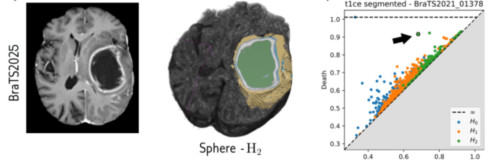
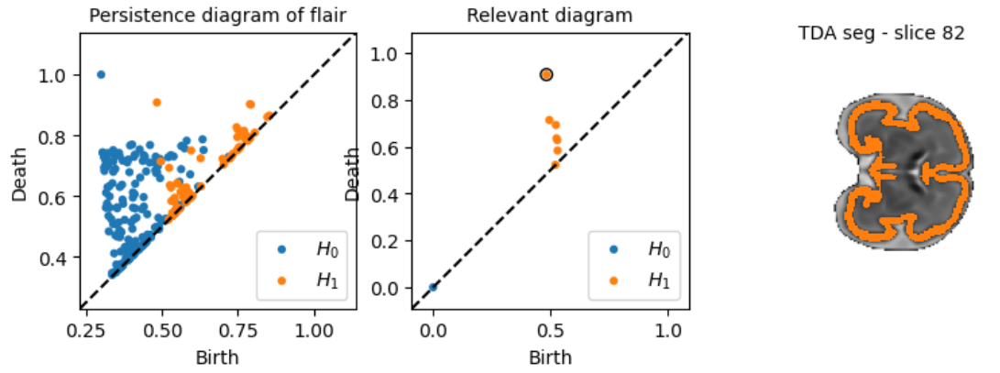
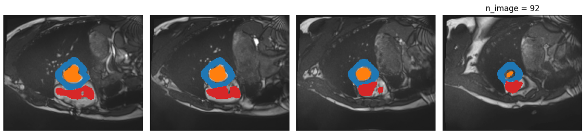

# Train-Free Segmentation in MRI with Cubical Persistent Homology

**Anton François & Raphaël Tinarrage**

This repository contains the code accompanying our article 
**Train-Free Segmentation in MRI with Cubical Persistent Homology**, 
to appear in the *Journal of Mathematical Imaging and Vision*.

## Overview

We propose a train-free segmentation framework based on persistent homology. 
The method combines simple intensity-based preprocessing with topological cues extracted from persistence diagrams, 
in order to segment anatomical structures.

The pipeline is organized into three steps:

1. **Detect the whole object** using automatic thresholding.
2. **Identify a geometrically meaningful subregion** using persistent homology.
3. **Deduce the remaining components** from their position relative to the detected structure.

## Results

Our two main applications are illustrated in the following Jupyter notebooks:
- **Glioblastoma** segmentation on BraTS 2025: [tutorial_brain_segmentation.ipynb](notebooks/tutorial_brain_segmentation.ipynb)
- **Cortical plate** segmentation on STA: [tutorial_fetal_segmentation.ipynb](notebooks/tutorial_fetal_segmentation.ipynb)

In addition, preliminary experiments on another dataset (not present in the article) can be found at:

- **Myocardium** segmentation on ACDC: [tutorial_cardiac_segmentation.ipynb](notebooks/tutorial_cardiac_segmentation.ipynb)

### Glioblastoma segmentation on BraTS

For glioblastoma segmentation, we use multi-modal MRI scans from the BraTS dataset. 
The goal is to recover the standard tumor regions: Whole Tumor (WT), Tumor Core (TC), Edema (ED), and Enhancing Tumor (ET). 
The method first detects WT as a hyper-intense component in the FLAIR modality. 
It then restricts the T1ce image to this region and uses cubical persistent homology to identify the enhancing tumor, 
which often carries a spherical topological signature. 
The remaining tumor components are finally deduced from their position inside or outside the detected enhancing structure.

### Cortical plate segmentation on STA

For fetal brain MRI, we consider cortical plate segmentation on the STA atlas, 
which provides one averaged 3D fetal brain image per gestational week. 
Here the task is single-class: extracting the cortical plate. 
We use a 2D slice-wise version of the method in the coronal plane. 
In most slices, the cortical plate appears as one or two circular structures, 
which can be detected through one-dimensional persistent homology. 
The final segmentation is obtained by selecting the topological features whose associated components best match the expected cortical plate geometry.

### Myocardium segmentation on ACDC

For cardiac MRI, we apply the framework to the ACDC dataset, which contains short-axis cine-MRI scans at end-diastole and end-systole. 
The segmentation task consists in identifying the left ventricle, right ventricle, and myocardium. 
Since the cardiac structures have heterogeneous intensities, the method is adapted by first locating the ventricular cavities, 
which appear as bright components, and then detecting the myocardium as the hypo-intense structure surrounding the left ventricle. 
Persistent homology is used to exploit the circular or cylindrical topology of the myocardium, either slice by slice in 2D or directly in 3D.

